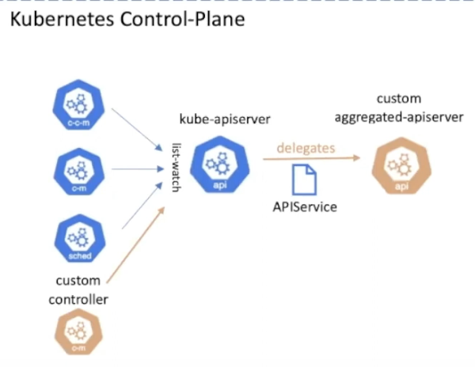
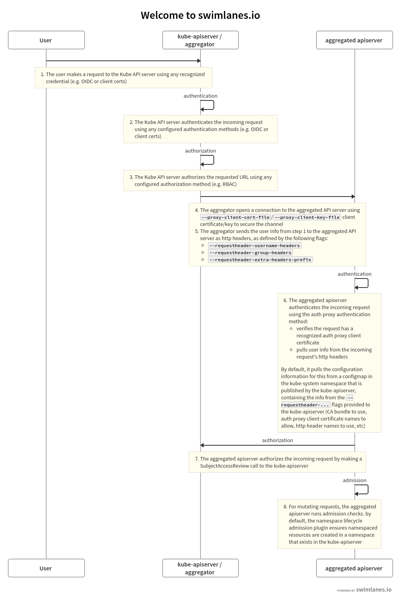

# aa-server

## 简介

aa-server（aggregated-apiserver）的设计思路是允许用户编写一个自定义的 APIServer，在这里面添加自定义 API。这个 APIServer 就可以跟 k8s 原生的 kube-apiserver 绑定部署在一起统一提供服务了。同时，构建出的 API 接口更加规范整齐，能利用 k8s 原生的认证、授权、准入机制。

不同于 CRD，aa-server 中的 API 资源是通过代码向 k8s 注册资源类型的方式实现的，而 CRD 是直接通过 yaml 文件创建自定义资源的方式实现的。


### 使用场景

- 非 Etcd 存储
- 需要扩展 /status 和 /scale 子资源，如 /logs、/port-forward 等
- 可以用 Go 高效实现所有操作，包括验证、准入和转换，尤其是支持大规模场景

### 处理流程

- 与 kube-apiserver 有着相同的结构
- 拥有自己的处理链：包括身份认证、日志审计、用户切换、限流和授权
- 拥有自己的资源处理链：包括解码、转换、准入、REST mapping 和编码
- 调用准入 webhook：
- 数据写入 Etcd：
- 拥有自己的 scheme 注册表：
- 委托 AuthN：通过 TokenAccessReview 委托 kube-apiserver 进行身份认证
- 审计：
- 委托 AuthZ：通过 SubjectAccessReivew 委托 kube-apiserver 进行授权


## Lab

### sample-apisrver

K8s 提供的 [kubernetes/sample-apiserver](https://github.com/kubernetes/sample-apiserver)，但是这个例子依赖于主 kube-apiserver。即使不使用authn/authz或API聚合，也是如此。需要通过 --kubeconfig 来指向一个主 kube-apiserver，样例中的 SharedInformer 依赖于会连接到主kube-apiserver来访问K8S资源。

it comes with the custom resources `Flunder` & `Fischer `under the `wardle.example.com` apigroup. 

#### 代码分析

通过对 sample-apiserver 的代码分析，APIServer 的核心类型是 GenericAPIServer，它是由 genericapiserver.CompletedConfig 的 New()方法生成的。后者则是 genericapiserver.RecommendedConfig 的 Complete()方法生成的。而 RecommendedConfig 又是从 enericoptions.RecommendedOptions 得到的。sample-apiserver 对 Config、Option、Server 等对象都做了一层包装，我们不关注这些 wrapper。

RecommendedOptions 对应了用户提供的各类选项（外加所谓推荐选项，降低使用时的复杂度），如 Etcd 地址、Etcd 存储前缀、APIServer 的基本信息等。调用 RecommendedOptions 的 ApplyTo 方法，会根据选项，推导出 APIServer 所需的，完整的配置信息。在这个方法中，甚至会进行自签名证书等重操作，而不是简单的将信息从 Option 复制给 Config。RecommendedOptions 会依次调用它的各个字段的 ApplyTo 方法，从而推导出RecommendedConfig的各个字段。RecommendedConfig 的 Complete 方法，再一次进行配置信息的推导，主要牵涉到 OpenAPI 相关的配置。CompletedConfig 的 New 方法实例化 GenericAPIServer，这一步最关键的逻辑是安装 API 组。API 组定义了如何实现GroupVersion 中 API 的增删改查，它将 GroupVersion 的每种资源映射到 registry.REST，后者具有处理 REST 风格请求的能力，并（默认）存储到 Etcd。

GenericAPIServer 提供了一些钩子来处理 Admission 控制器的注册、初始化。以及另外一些钩子来对 API Server 的生命周期事件做出响应。

#### Lab

#### 准备一个K8S集群，提供主APIServer

```shell
go install sigs.k8s.io/kind@v0.14.0 && kind create cluster
kubectl config use-context kind-kind
```

##### 客户端访问凭证

```shell
cd /tmp
openssl req -nodes -new -x509 -keyout ca.key -out ca.crt # 可随意填写
openssl req -out client.csr -new -newkey rsa:4096 -nodes -keyout client.key -subj "/CN=development/O=system:masters"
openssl x509 -req -days 365 -in client.csr -CA ca.crt -CAkey ca.key -set_serial 01 -out client.crt
openssl pkcs12 -export -in ./client.crt -inkey ./client.key -out client.p12 # 密码设置为 P@ssw0rd
```

##### 构建和启动 AA server

```shell
cd $GOPATH/src/k8s.io/
git clone https://github.com/kubernetes/sample-apiserver.git
cd sample-apiserver/
git checkout release-1.22
go mod vendor
hack/update-codegen.sh
etcd # 启动ETCD数据库
go run main.go --secure-port 8443 --etcd-servers http://127.0.0.1:2379   --kubeconfig ~/.kube/config --authentication-kubeconfig ~/.kube/config --authorization-kubeconfig ~/.kube/config --client-ca-file=/tmp/ca.crt
```

##### 测试：直接调用AA Server

直接通过 URL 调用 AA server，如果要用 kubectl，还需要配置 kind k8s 集群。

```shell
curl -fv -k --cert-type P12 --cert /tmp/client.p12:P@ssw0rd \
https://localhost:8443/apis/wardle.example.com/v1alpha1/namespaces/default/flunders
```


## Tmp




- **kube-aggregator**: It is the controller associated with apiregistration API and  constitutes what we call the aggregation layer. It is responsible for  discovering and registering extension apiservers and acting as a **front-proxy** to the individual extension apiservers.
- **extension-apiserver**: API servers written using the library [kube-apiserver](https://github.com/kubernetes/apiserver). Provides a way of defining custom APIs that are deeply integrated with core Kubernetes API machinery. [Compared](https://docs.google.com/document/d/1y16jKL2hMjQO0trYBJJSczPAWj8vAgNFrdTZeCincmI/edit#heading=h.qzaj1hoslggu) to [CRDs](https://kubernetes.io/docs/concepts/extend-kubernetes/api-extension/custom-resources/), it offers more features and options for dealing with performance, policy and customization.

A request to an API path that is served by an extension apiserver begins the same way as all API requests: communication to the Kubernetes  apiserver. This path already has been registered with the Kubernetes  apiserver by the extension apiserver. The high-level flow is as follows:

1. Kubernetes apiserver: authenticate the requesting user and authorize their rights to the requested API path.
2. Kubernetes apiserver: proxy the request to the extension apiserver
3. Extension apiserver: authenticate the request from the Kubernetes apiserver
4. Extension apiserver: authorize the request from the original user
5. Extension apiserver: execute




### delegated authN

The Kubernetes apiserver will need to communicate with your extension  apiserver, and your extension apiserver will need to communicate with  the Kubernetes apiserver. In order for this communication to be secured, the Kubernetes apiserver uses x509 certificates to authenticate itself  to the extension apiserver.

The mechanism where-in API calls to the extension-apiserver are  authenticated & authorized by the core kubernetes apiserver  (kubernetes master)


The Kubernetes apiserver connects to the extension apiserver over  TLS, authenticating itself using a client certificate. You must provide  the following to the Kubernetes apiserver upon startup, using the  provided flags:

- private key file via `--proxy-client-key-file`
- signed client certificate file via `--proxy-client-cert-file`
- certificate of the CA that signed the client certificate file via `--requestheader-client-ca-file`
- valid Common Name values (CNs) in the signed client certificate via `--requestheader-allowed-names`

The Kubernetes apiserver will use the files indicated by `--proxy-client-*-file` to authenticate to the extension apiserver. In order for the request to be considered valid by a compliant extension apiserver, the following  conditions must be met:

1. The connection must be made using a client certificate that is signed by the CA whose certificate is in `--requestheader-client-ca-file`.
2. The connection must be made using a client certificate whose CN is one of those listed in `--requestheader-allowed-names`.

When started with these options, the Kubernetes apiserver will:

1. Use them to authenticate to the extension apiserver.
2. Create a configmap in the `kube-system` namespace called `extension-apiserver-authentication`, in which it will place the CA certificate and the allowed CNs. These in turn can be retrieved by extension apiservers to validate requests.

Note that the same client certificate is used by the Kubernetes apiserver to authenticate against *all* extension apiservers. It does not create a client certificate per  extension apiserver, but rather a single one to authenticate as the  Kubernetes apiserver. This same one is reused for all extension  apiserver requests.

When the Kubernetes apiserver proxies the request to the extension  apiserver, it informs the extension apiserver of the username and group  with which the original request successfully authenticated. It provides  these in http headers of its proxied request. You must inform the  Kubernetes apiserver of the names of the headers to be used.

- the header in which to store the username via `--requestheader-username-headers`
- the header in which to store the group via `--requestheader-group-headers`
- the prefix to append to all extra headers via `--requestheader-extra-headers-prefix`

These header names are also placed in the `extension-apiserver-authentication` configmap, so they can be retrieved and used by extension apiservers.

### delegated authZ

AA server delegates authz to kube-apiserver, via `authorization.k8s.ios.SubjectAccessReview` API

The extension apiserver now can validate that the user/group  retrieved from the headers are authorized to execute the given request.  It does so by sending a standard SubjectAccessReview request to the Kubernetes apiserver.

In order for the extension apiserver to be authorized itself to submit the `SubjectAccessReview` request to the Kubernetes apiserver, it needs the correct permissions. Kubernetes includes a default `ClusterRole` named `system:auth-delegator` that has the appropriate permissions. It can be granted to the extension apiserver's service account.


### admission control

AA server delegates admisssion controllers to kube-apiserver, via `admission.k8s.ios.AdmissionReview` API


### Non-ETCD Persistent Layer


### Setup an AA Server

Setting up an extension API server to work with the aggregation layer  allows the Kubernetes apiserver to be extended with additional APIs,  which are not part of the core Kubernetes APIs.


