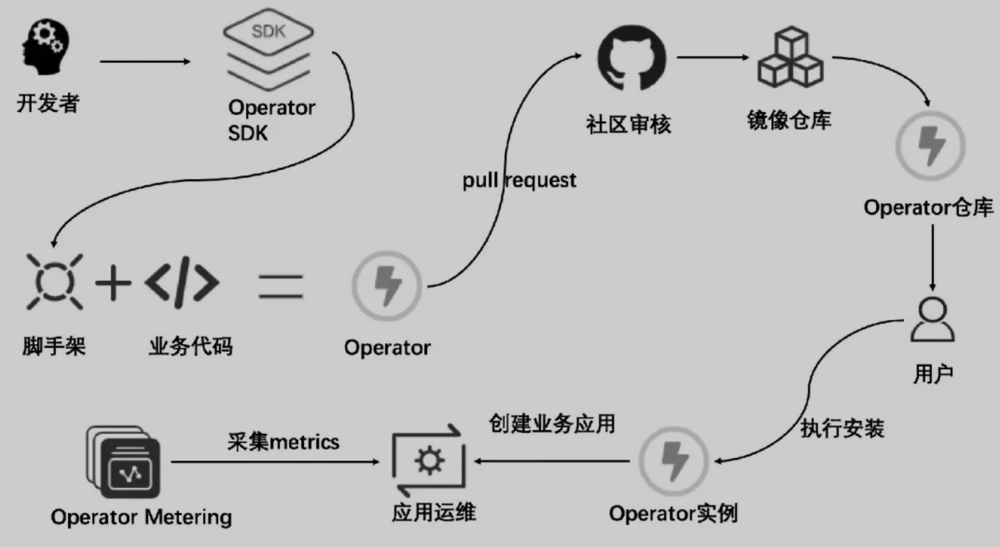

# kubebuilder

## Operator

Operator 框架 = 自定义 CRD + 自定义 Controller + Admission

Operator 是一种 K8s 的扩展形式，可以帮助用户以 K8s 的声明式 API 风格自定义来管理应用及服务，Operator 已经成为分布式应用在 K8s 集群部署的事实标准。

不用于之前controller，operator还包含了一些运维逻辑，比如应用的生命周期管理，实现了一些常见操作的自动化。

### 历史

CoreOS 在 2016 年底提出了 Operator 的概念，当时的一段官方定义如下：“An Operator represents human operational knowledge in software, to reliably manage an application.”

谷歌率先提出了 TPR（Third Party Resource）的概念，允许开发者根据业务需求以插件化形式扩展出相应的 K8s API 对象模型，同时提出了自定义 controller 的概念用于编写面向领域知识的业务控制逻辑，基于 Third Party Resource，K8s 社区在 1.7 版本中提出了[custom resources and controllers](https://mp.weixin.qq.com/s?__biz=MzUzNzYxNjAzMg==&mid=2247493984&idx=1&sn=59238e3a71d14702191e5c518b749836&chksm=fae6e2afcd916bb92a15170911643357ac56fa72ae9bf844b500fbd5e5253fd741f5af0d797c&token=10947129&lang=zh_CN&scene=21#wechat_redirect) 的概念，这正是 Operator 的核心概念。

CoreOS 是最早的一批基于 K8s 提供企业级容器服务解决方案的厂商之一，他们很敏锐地捕捉到了 TPR  和控制器模式对企业级应用开发者的重要价值。并很快由邓洪超等人基于 TPR 实现了历史上第一个 Operator：etcd-operator。它可以让用户通过短短的几条命令就快速的部署一个 etcd 集群，并且基于 kubectl  命令行一个普通的开发者就可以实现 etcd 集群滚动更新、灾备、备份恢复等复杂的运维操作，极大的降低了 etcd 集群的使用门槛，在很短的时间就成为当时 K8s 社区关注的焦点项目。

而 Operator 的出现打破了社区传统意义上的格局，对于谷歌团队而言，Controller 作为 Kubernetes 原生 API  的核心机制，应该交由系统内部的 Controller Manager 组件进行管理，并且遵从统一的设计开发模式，而不是像 Operator 那样交由应用开发者自由地进行 Controller 代码的编写。另外 Operator 作为 K8s 生态系统中与终端用户建立连接的桥梁，作为 K8s 项目的设计和捐赠者，谷歌当然也不希望错失其中的主导权。同时 Brendan Burns 突然宣布加盟微软的消息，也进一步加剧了谷歌团队与 Operator 项目之间的矛盾。于是，2017 年开始谷歌和 RedHat 开始在社区推广 Aggregated Apiserver，应用开发者需要按标准的社区规范编写一个自定义的  Apiserver，同时定义自身应用的 API 模型。通过原生 Apiserver 的配置修改，扩展 Apiserver 会随着原生组件一同部署，并且限制自定义 API 在系统管理组件下进行统一管理。之后，谷歌和 RedHat 开始在社区大力推广使用聚合层扩展  K8s API，同时建议废弃 TPR 相关功能。

然而，巨大的压力并没有让 Operator 昙花一现，就此消失。相反，社区大量的 Operator 开发和使用者仍旧拥护着 Operator 清晰自由的设计理念，继续维护演进着自己的应用项目。同时很多云服务提供商也并没有放弃 Operator，Operator  简洁的部署方式和易复制，自由开放的代码实现方式使其维护住了大量忠实粉丝。在用户的选择面前，强如谷歌、红帽这样的巨头也不得不做出退让。最终，TPR 并没有被彻底废弃，而是由 CRD（Custom Resource Definition）资源模型范式代替。2018 年初，RedHat 完成了对 CoreOS 的收购，并在几个月后发布了 Operator Framework，通过提供 SDK 等管理工具的方式进一步降低了应用开发与 K8s 底层 API 知识体系之间的依赖。至此，Operator 进一步巩固了其在 K8s 应用开发领域的重要地位。【1】

### 生命周期

- 开发者使用 Operator SDK 创建一个 Operator 项目；
- SDK 生成 Operator 对应的脚手架代码，然后扩展相应业务模型和 API，实现业务逻辑完成 Operator 的代码编写；
- 参考社区[测试指南](https://mp.weixin.qq.com/s?__biz=MzUzNzYxNjAzMg==&mid=2247493984&idx=1&sn=59238e3a71d14702191e5c518b749836&chksm=fae6e2afcd916bb92a15170911643357ac56fa72ae9bf844b500fbd5e5253fd741f5af0d797c&token=10947129&lang=zh_CN&scene=21#wechat_redirect)进行业务逻辑的本地测试以及打包和发布格式的本地校验；
- 在完成测试后可以根据[规定格式](https://mp.weixin.qq.com/s?__biz=MzUzNzYxNjAzMg==&mid=2247493984&idx=1&sn=59238e3a71d14702191e5c518b749836&chksm=fae6e2afcd916bb92a15170911643357ac56fa72ae9bf844b500fbd5e5253fd741f5af0d797c&token=10947129&lang=zh_CN&scene=21#wechat_redirect)向社区提交[PR](https://mp.weixin.qq.com/s?__biz=MzUzNzYxNjAzMg==&mid=2247493984&idx=1&sn=59238e3a71d14702191e5c518b749836&chksm=fae6e2afcd916bb92a15170911643357ac56fa72ae9bf844b500fbd5e5253fd741f5af0d797c&token=10947129&lang=zh_CN&scene=21#wechat_redirect)，会有专人进行 review；
- 待社区审核通过完成 merge 后，终端用户就可以在 OperatorHub.io 页面上找到业务对应的 Operator 的说明文档和安装指南，通过简单的命令行操作即可在目标集群上完成 Operator 实例的安装；
- Operator 实例会根据配置创建所需的业务应用，OLM 和 Operator Metering 等组件可以帮助用户完成业务应用对应的运维和监控采集等管理操作。



### 原理

Operator 定义了一组在 K8s 集群中打包和部署复杂业务应用的方法，它可以方便地在不同集群中部署并在不同的客户间传播共享。同时 Operator 还提供了一套应用在运行时的监控管理方法，领域专家通过将业务关联的运维逻辑写入到 operator  自身控制器中，而一个运行中的 operator 就像一个 7*24 不间断工作的优秀运维团队，可以时刻监控应用自身状态和该应用在 K8s 集群中的关注事件，并在毫秒级别基于期望终态做出对监听事件的处理，比如对应用的自动化容灾响应或是滚动升级等高级运维操作。


#### Controller/Operator

Operator 是一种 K8s 的扩展形式，利用 Custom  Resource 来管理应用和组件，允许用户以 K8s 的声明式 API 风格来管理应用及服务，支持 kubectl 命令行。同时 Operator 开发者可以像使用原生 API 进行应用管理一样，通过声明式的方式定义一组业务应用的期望终态，并且根据业务应用的自身特点进行相应控制器逻辑编写，以此完成对应用运行时刻生命周期的管理并持续维护与期望终态的一致性。这样的设计范式使得应用部署者只需要专注于配置自身应用的期望状态，而无需再投入大量的精力在手工部署或是业务在运行时刻的繁琐运维操作中。

在 K8s 实现的思想中，会使用 Controller 模式对 etcd 里的 API 资源对象变化保持不断的监听（Watch），并在 Controller 中对指定事件进行响应处理，针对不同的 API 资源可以在对应的控制器中添加相应的业务逻辑，通过这种方式完成应用编排中各阶段的事件处理。而 Operator 正是基于控制器模式，允许应用开发者通过扩展 K8s API 资源的方式，将复杂的分布式应用集群抽象为一个自定义的 API 资源，通过对自定义 API 资源的请求可以实现基本的运维操作，而在 Operator 中开发者可以专注实现应用在运行时管理中遇到的相关复杂逻辑。

Operator 定义了一组在 K8s 集群中打包和部署复杂业务应用的方法，Operator 主要是为解决特定应用或服务关于如何部署、运行及出现问题时如何处理提供的一种特定的自定义方式。比如：

- 按需部署应用服务（总不能用一大堆 configmap 来管理吧）
- 实现应用状态的备份和还原，完成版本升级
- 为分布式应用进行 master 选举，例如 etcd


## 架构

### Manager


### Controller


### Webhook


### Cluster

#### Client


#### Cache


## controller-runtime

该项目包含若干 Go 库，用于快速构建控制器。kubebuilder 的 SDK 依赖于此项目，使用 controller-runtime 的 Client 接口来实现针对 K8S 资源的 CRUD 操作。

- Manager：用于启动（Manager.Start）控制器，管理被多个控制器共享的依赖，例如 Cache、Client、Scheme。通过manager.Manager 来创建 client.Client，SDK 生成的代码中包含创建 Manager 的逻辑，Manager 持有一个 Cache 和一个 Client。
- Cache：为读客户端提供本地缓存，支持监听更新缓存的事件。
  - DelegatingClient：从 Cache 中读取（Get/List），写入（Create/Update/Delete）请求则直接发送给 API Server。使用 Cache 可以大大减轻 API Server 的压力，随着缓存的更新，读操作会达成最终一致。
- Client：实现针对 kube-apiserver 的 CRUD 操作，读写客户端通常是分离（split）的。

### Controller

controller持有一个Reconciler，此外它从 Manager 得到各种共享对象，它自己创建一个工作队列。

Controller 可能会监控多种类型的对象（如 Pod + ReplicaSet + Deployment），但是 Controller 的 Reconciler 一般仅仅处理单一类型的对象。

当 A 类型的对象发生变化后，如果 B 类型的对象必须更新以响应，可以使用 EnqueueRequestFromMapFunc 来将一种类型的事件映射为另一种类型。如 Deployment 的 Controller 可以使用 EnqueueRequestForObject、EnqueueRequestForOwner 实现：

1. 监控 Deployment 事件，并将 Deployment 的 Namespace/Name 入队
2. 监控 ReplicaSet 事件，并将创建它的 Deployment（Owner）的 Namespace/Name 入队

类似 ReplicaSet 的控制器也可以监控 ReplicaSet 和 Pod 事件。

 reconcile.Request 入队时会自动去重，也就是说一个 ReplicaSet 创建的多个 Pod 事件可能仅仅触发 ReplicaSet 控制器的单次调用。

#### Reconciler

Reconciler 是 Controller 的核心逻辑所在，它负责调和使 status  逼近期望状态 spec。例如，当针对 ReplicaSet 对象调用 Reconciler 时，发现 ReplicaSet 要求 5 实例，但是当前系统中只有 3 个 Pod。这时 Reconciler 应该创建额外的两个 Pod，并且将这些 Pod 的 OwnerReference 指向前面的 ReplicaSet。

Reconciler 通常仅处理一种类型的对象，OwnerReference 用于从子对象（如 Pod）触发父对象的调和（如 ReplicaSet）操作。


## Dev

### group/version/xx_types.go

建立、更新 CRD 对应的 struct，然后需要运行 `make`。


### controller/kind/xx_controller.go

在 Reconcile() 中写入核心业务逻辑，然后可以运行 operator `make run`。


### Config/samples/xx.yaml

需要根据 CRD 建立自己的 CR。


## Lab

### kubebuilder-demo

- 初始化 kubebuilder
```shell
kubebuilder init --domain wukong.com --repo github.com/rebirthmonkey/kubebuilder-demo
```

- 创建 API
```shell
kubebuilder create api --group ingress --version v1 --kind App
```

- install CRDS
```shell
make install
```

- 在 controller/Reconcile() 中添加代码
```go
    _ = log.FromContext(ctx)
	fmt.Println("XXXXXXXX app changed", "ns", req.Namespace)
	return ctrl.Result{}, nil
```

- run operator
```shell
make run  
```

- 添加 CR：此处 CR 未填入具体内容，因为只是为了测试 Reconsile() log 是否输出。
```shell
kubectl delete -f config/samples/ingress_v1beta1_app.yaml 
```


### kubebuilder-at

启动一个 称为 AT 的 CR，在 AT 中 schedule 配置的 UTC 时间、执行在 CR 中 command 配置的命令。

整个执行过程（CR 的 status）分为 3 个阶段：pending、running、done。

#### 创建脚手架
```shell
$ mkdir kubebuilder-at && cd $_

$ kubebuilder init \
              --domain wukong.com \
              --repo github.com/rebirthmonkey/k8s-dev/kubebuilder-at
```

#### 创建 API/controller
```shell
$ kubebuilder create api \
              --group cnat \
              --version v1alpha1 \
              --kind At
Create Resource under pkg/apis [y/n]?
y
Create Controller under pkg/controller [y/n]?
y
...
```

#### 创建/安装 CRD
```shell
make install
```

#### 运行 Operator
```shell
make run
```

#### 添加 CR Yaml

```shell
kubectl apply -f config/samples/cnat_v1alpha1_at.yaml
kubectl delete -f config/samples/cnat_v1alpha1_at.yaml
```

#### 修改 api/v1alpha1/at_types.go

修改了 const、AtSpec 和 AtStatus 三处

```go
const (
PhasePending = "PENDING"
PhaseRunning = "RUNNING"
PhaseDone    = "DONE"
)

// EDIT THIS FILE!  THIS IS SCAFFOLDING FOR YOU TO OWN!
// NOTE: json tags are required.  Any new fields you add must have json tags for the fields to be serialized.

// AtSpec defines the desired state of At
type AtSpec struct {
// INSERT ADDITIONAL SPEC FIELDS - desired state of cluster
// Important: Run "make" to regenerate code after modifying this file

Schedule string `json:"schedule,omitempty"`
// Command is the desired command (executed in a Bash shell) to be executed.
Command string `json:"command,omitempty"`
}

// AtStatus defines the observed state of At
type AtStatus struct {
// INSERT ADDITIONAL STATUS FIELD - define observed state of cluster
// Important: Run "make" to regenerate code after modifying this file
Phase string `json:"phase,omitempty"`
}
```

```shell
make
```

#### 修改 controllers/at_controllers.go
详细代码见 [at_controllers.go](30_kubebuilder-at/at_controller.go)

#### 启动 operator
```shell
make run
```

#### 创建 CR
CR 内容改为
```yaml
apiVersion: cnat.wukong.com/v1alpha1
kind: At
metadata:
  name: at-sample
spec:
  schedule: "2022-06-11T03:50:31Z"
  command: "echo YAY"
```

```shell
kubectl apply -f config/samples/cnat_v1alpha1_at.yaml
```


## Ref

1. [kubebuilder Book](https://book.kubebuilder.io/introduction.html)
2. [扩展K8S](https://blog.gmem.cc/crd)
3. 

